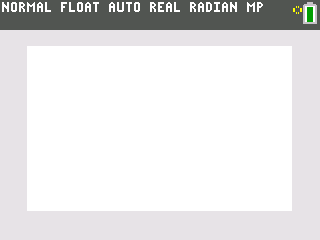

# TI Matrix Drawing

Ce petit projet réalisé pendant un cours de maths (merci à Mr Cazaux de m'avoir supporté pendant toute l'année) permet de dessiner le contenu de matrices 20x20 sur l'écran de la calculatrice.

Il supporte jusqu'à 14 couleurs différentes.

# Histoire

- Ce projet débute pendant un cours sur les logarithmes népériens durant lequel je n'ai pas trop écouté (je me suis rattrapé depuis)
- La première version dessine des matrices 5x5 en environ 5 minutes et ne supporte qu'une seule commande
- Ensuite vient l'ajout des couleurs et la modification de la taille des matrices de 5x5 en 20x20
- La dernière mise à jour ayant rendu le temps de dessin beaucoup trop long, je décide de dessiner en utilisant des lignes plutôt que pixel par pixel, ce qui permet d'accélérer drastiquement le temps de dessin (environ 500% plus rapidement)
- Enfin, j'ajoute la possibilité de choisir la matrice à dessiner au lieu de simplement dessiner la matrice [A] ce qui permet de stocker différents dessins.
- Noémie, une camarade de classe avec de grands talents d'artiste, décide de créer ses prochaines oeuvres en utilisant mon programme, chose qui m'arrange car mon chat dessine mieux que moi.

# Utilisation

1 - Téléversez le fichier `DESSIN.8xp` dans votre calculatrice à l'aide d'un logiciel comme TI-connect ou recopiez le à la main (voir fin du readme).

2 - Remplissez une matrice 20x20 avec des nombres entre 0 et 14 (0 pour ne rien dessiner, le reste pour les couleurs). Attention, n'utilisez surtout pas la matrice [A] car elle sert de mémoire cache au programme et sera donc effacée à chaque lancement du programme !

3 - Lancez le programme et selectionnez votre matrice

4 - Laissez la magie opérer !

# Exemples 

Voici quelques exemples de dessins, quasiment tous créés par Noémie, disponibles dans le dossier `matrices` :

<table border="0">
    <tr>
        <td>
            
            <br>
            "Weed-frog" - Matrice B
            <br><br>
            
            <br>
            "Pique-à-Chou" - Matrice F
            <br><br>
            
            <br>
            "Chiara" - Matrice E
            <br><br>
            
            <br>
            "Dieu Bg" - Matrice C
            <br><br>
            
            <br>
            "La petite maison dans la prairie dans Minecraft dans une calculatrice" - Matrice I
            <br><br>
        </td>
        <td>
            
            <br>
            "Le frère de Luigi" - Matrice G
            <br><br>
            
            <br>
            "Balle à Pique-à-Chou" - Matrice H
            <br><br>
            
            <br>
            "El Profesor" - Matrice D
            <br><br>
            
            <br>
            "Ceci n'est pas un oeil" - Matrice J
            <br><br>
        </td>
    </tr>
</table>

# Code

Les textes commencant par :" sont des commentaires.

```
Disp "VEUILLEZ FOURNIR"
Disp "UNE MATRICE"
Input [A] :" On demande à l'utilisateur de donner une matrice

:" Ici on règle la zone d'affichage pour effacer les précédents dessins, désactiver les axes et avoir des pixels carrés et pas rectangles
ZStandard
ZCarré
EffDess
AxesNAff

:" Deux boucles : une pour dessiner les lignes et l'autre pour les colonnes, au final ca nous fait du case par case
For(X,1,20)
For(Y,1,20)

If [A](X,Y)≠0 :" On ne dessine pas si le numéro de la case est 0
Then

:" Une boucle pour dessiner un carré, ligne par ligne (de gauche à droite)
For(I,Y-11,Y-10,0.2)

Ligne(I,­X+11,I,­X+10,[A](X,Y)+10)

End

End

End
End
```